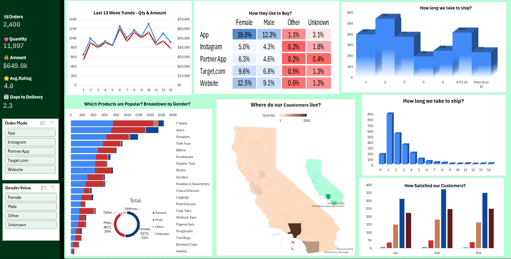

📊 E-commerce Data Analytics Dashboard (Excel)

📌 Project Overview
This project showcases an **interactive E-commerce Data Analytics Dashboard** built using **Microsoft Excel**.  
The dashboard is designed to analyze sales performance, customer behavior, delivery efficiency, and customer satisfaction to support **data-driven business decisions**.

---

🎯 Project Objective
To analyze E-commerce sales data and provide **actionable business insights** using Excel-based data analytics techniques.

---

🛠 Tools & Techniques
- Microsoft Excel
- Data Cleaning & Formatting
- Pivot Tables
- Pivot Charts
- KPI Metrics
- Slicers & Filters
- Exploratory Data Analysis (EDA)

---

📈 Key Insights Covered
- Sales performance and order trends
- Customer purchase behavior by gender
- Product demand analysis
- Delivery time efficiency
- Customer satisfaction trends
- Channel-wise sales analysis (App, Website, Instagram, Partner App)

---

🖼 Dashboard Preview

> Interactive Excel dashboard built using Pivot Tables, KPIs, and slicers to perform exploratory data analysis on E-commerce sales data.

---

📂 Project Files
- 📊 **Excel Dashboard File:** `ecommerce_sales_data.xlsx`
- 🖼 **Dashboard Preview Image:** `Ecommerce_Sales_Dashboard.png`

> Download the Excel file to explore the interactive dashboard using slicers and filters.

---

🚀 How to Use
1. Download the Excel file: `ecommerce_sales_data.xlsx`
2. Open the file and enable editing/content
3. Use slicers to filter data by Gender and Order Mode
4. Analyze KPIs, trends, and customer insights dynamically

---

🧠 Key Learnings
- Converting raw data into meaningful insights
- Building executive-friendly dashboards in Excel
- Using KPIs and visual storytelling for decision-making
- Applying EDA techniques using Pivot Tables

---

📬 Contact:
Name: K Sowmya  
Role: Aspiring Data Analyst  
GitHub: https://github.com/SowmyaK27  
LinkedIn : https://www.linkedin.com/in/sowmya-k-bab694355/
